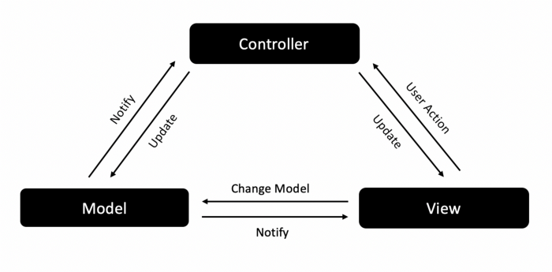
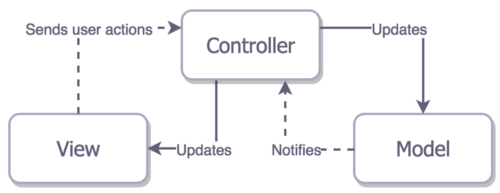
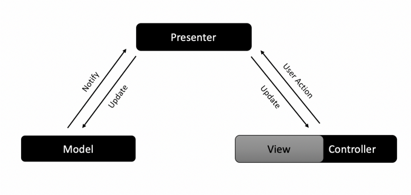

# MVC 
## 传统 MVC

## Apple 提出的 MVC

## MVC 的问题
1.  C 处理了几乎所有的事情, 造成臃肿
2.  单元测试困难, 因为逻辑都在 C 中
3.  扩展性差
4.  难以维护, 尤其是项目变大以后

# MVP

MVP 在 MVC 的基础上演化而来，从 C 中拆分出了 P， 演变成了 M-VC-P
这样讲业务逻辑放到了 P 中, VC 中就只负责布局, 改善了 MVC 的问题

## MVP 的问题
P 同 VC 进行交互是通过定义的接口, 这里可能存在很多的接口, 实现起来就会复杂
同时 可能存在很多个 P 导致代码量增大

# MVVM

MVVM 在 MVP 的基础上进行演化, 实际上是 M-VC-VM, 通过数据绑定的方式，优化了 MVP 中
P 同 VC 的交互问题

# 如何选择模式？

1. 如果项目简单小巧，直接使用 MVC ，上手更快，代码量也少
2. 如果需要单元测试, 同时又对响应式编程熟悉, 设计到状态的变化多, 推荐使用 MVVM
3. 如果需要单元测试，团队开发又不会响应式编程，可选用 MVP

这里有一篇文章写的非常好, 强烈推荐 [地址](https://medium.com/@dev.omartarek/mvp-vs-mvvm-in-ios-using-swift-337884d4fc6f)
